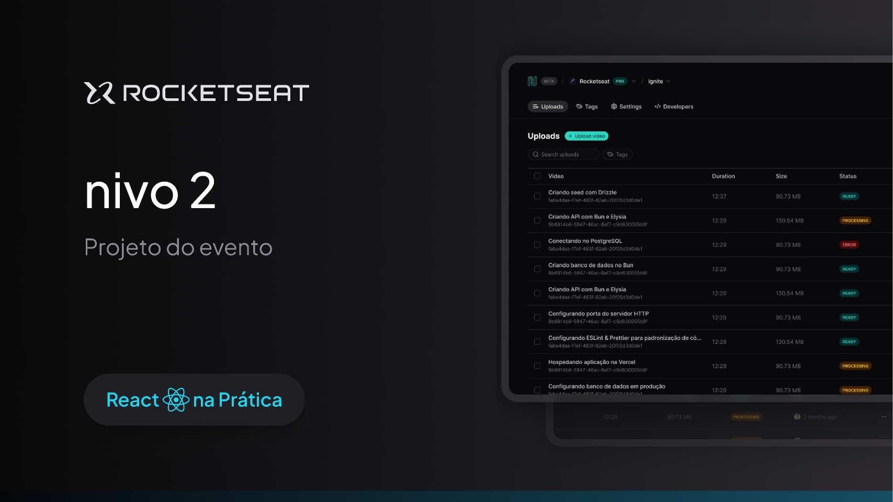

  

## 💻 Projeto
Esse projeto foi desenvolvido durante as aulas de React na Prática da [Rocketseat](https://rocketseat.com.br).

## 🚀 Tecnologias

Esse projeto foi desenvolvido com as seguintes tecnologias:

- React.js
- TailwindCSS
- JSON Server
- React Query
- RadixUI

## 🔖 Layout

Você pode ver o layout do projeto
[aqui](https://www.figma.com/file/AMKxpMs85p9rcKMkDuSOk8/Nivo-(React-na-pr%C3%A1tica)-(Community)?type=design&node-id=0%3A1&mode=design&t=gMoqqih0bYOjSXVC-1).
